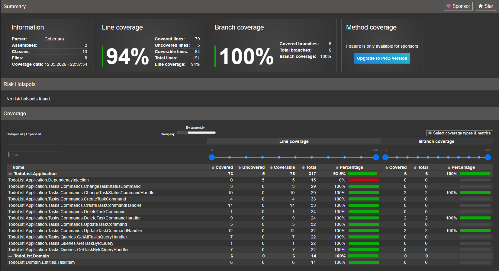
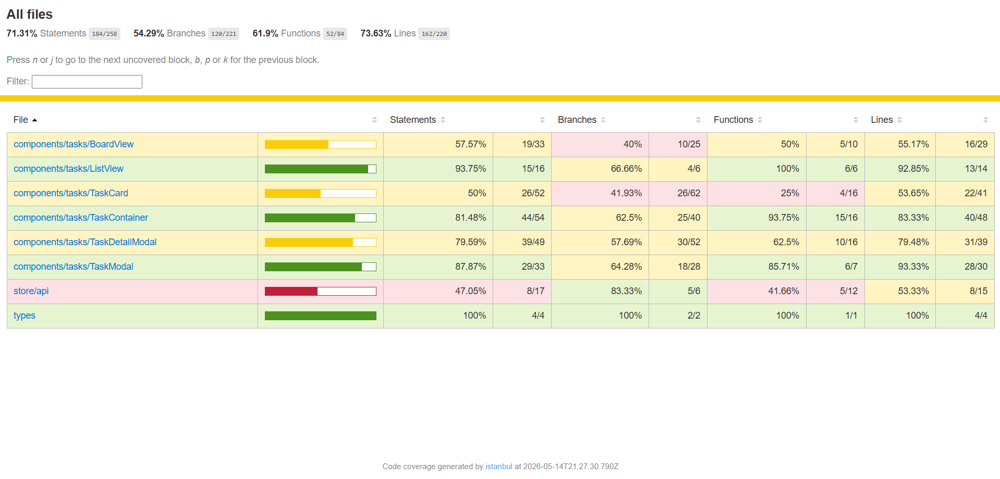

# Todo List Application

A fully-featured Full-Stack application for managing tasks (Todo List) using modern technologies, built on Clean Architecture and CQRS principles.

## 📋 Description & Features

The application allows users to efficiently manage their daily tasks through an intuitive interface.

**Core Features:**
- **Task Management:** Create, edit, delete, and view task details.
- **Organization:** Ability to set deadlines and statuses (Todo, In Progress, Done).
- **Drag-and-Drop:** Seamlessly drag and drop tasks between columns on the board to quickly change their status.
- **View Modes:** Two display modes for tasks: Board (Kanban-board) and List.
- **Search & Filtering:** Instant task search by title or description, sorting by date or deadline, and filtering by status.
- **Notifications:** Modals for successful actions or errors.

---

## 🛠 Tech Stack

### Frontend (Client)
* **Framework:** React + TypeScript
* **Build Tool:** Vite
* **State Management & API:** Redux Toolkit + RTK Query
* **Styling:** CSS Modules, Ant Design (partially for loaders)
* **Testing:** Jest, React Testing Library, MSW (Mock Service Worker)

### Backend (API)
* **Platform:** .NET 9, C#, ASP.NET Core Web API
* **Architectural Pattern:** Clean Architecture, CQRS (MediatR)
* **Data Access:** Entity Framework Core (EF Core)
* **Database:** Microsoft SQL Server (MSSQL)
* **Observability:** OpenTelemetry (integrated with SigNoz)
* **Testing:** xUnit, Moq

### Infrastructure
* Docker & Docker Compose (for database and monitoring tools deployment).

---

## 🏗 Project Architecture

The backend is built following **Clean Architecture** principles, dividing the system into loosely coupled layers:
1. **Domain (`TodoList.Domain`):** Contains business models (`TaskItem`), enums (`TaskStatus`), and repository interfaces.
2. **Application (`TodoList.Application`):** Contains business logic. Implements the CQRS pattern using the **MediatR** library (separated into Commands and Queries).
3. **Infrastructure (`TodoList.Infrastructure`):** Implements data access (EF Core `DbContext`) and MSSQL connectivity.
4. **API (`TodoList.Api`):** The entry point, containing controllers, Dependency Injection configuration, and Middleware for error handling and OpenTelemetry.

The frontend is structured using a component-based approach, separating data fetching logic (RTK Query) from UI components.

---

## 🚀 Run Instructions

### Prerequisites
- [Node.js](https://nodejs.org/) (version 18 or higher)
- [.NET 8 SDK](https://dotnet.microsoft.com/download/dotnet/8.0)
- [Docker Desktop](https://www.docker.com/products/docker-desktop) (for running MSSQL)

### 1. Start the Database (via Docker)
There is a `docker-compose.yml` file in the project root containing settings for MSSQL (and optionally SigNoz).
```bash
docker-compose up -d
```
*This command will start SQL Server on port 1433.*

### 2. Start the Backend
Navigate to the API folder, apply database migrations, and start the server:
```bash
cd api/src/TodoList.Api
dotnet ef database update  # apply migrations (if EF CLI is installed)
dotnet run
```
*The API will be available at `http://localhost:5000` or `https://localhost:5001` (check `launchSettings.json`). Swagger UI is also available.*

### 3. Start the Frontend
Open a new terminal, navigate to the client folder, install dependencies, and start the development server:
```bash
cd client
npm install
npm run dev
```
*The frontend will be available at `http://localhost:5173`. The API URL is proxied through Vite settings.*

---

## 🧪 Testing

The project implements comprehensive test coverage for both the frontend and backend, adhering to the **AAA (Arrange-Act-Assert)** pattern.

### Backend Tests
Uses `xUnit` and `Moq`. Covers all essential Command and Query handlers (Happy path and Edge cases, e.g., verifying `KeyNotFoundException`).
**To Run:**
```bash
cd api/tests/TodoList.Tests
dotnet test
```

### Frontend Tests
Uses `Jest`, `React Testing Library`, and `MSW`.
- Tested UI components (filtering, sorting, modal rendering).
- Uses **MSW (Mock Service Worker)** for network-level HTTP request interception, enabling full testing of RTK Query hooks (successful data fetching, 500 server error handling, and cache invalidation on mutations).
**To Run:**
```bash
cd client
npm run test
```

### Code Coverage 

